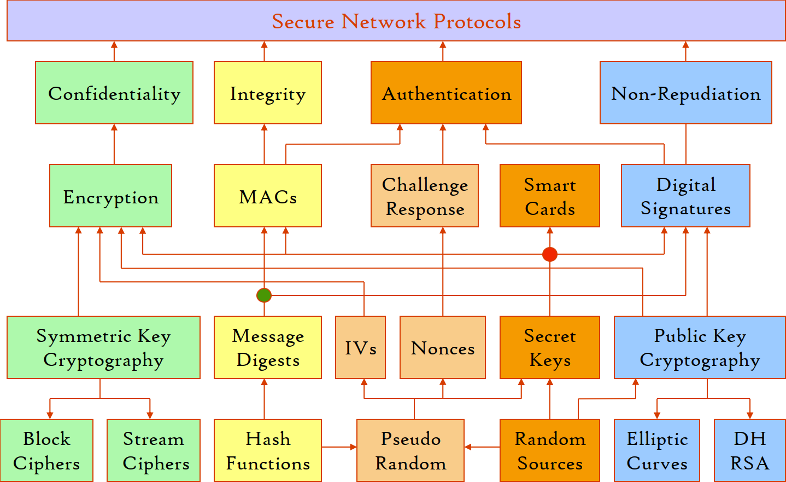

# Cryptographic Protocols
[Wikipeida](https://en.wikipedia.org/wiki/Cryptographic_protocol)

## Protocols
- [Internet Protocol Security (IPsec)](IP/README.md)

- [Transport Layer Security](Transport/README.md)

- [Messaging Layer Security](Messaging/README.md)

- [CurveCP: Usable security for the Internet](https://curvecp.org/)
  - [curvecp: CurveCP programs, linked with TweetNaCl and built statically with Musl libc](https://github.com/philanc/curvecp)
    
    4k lines of code.

- [MST: Minimal Secure Transport Library](https://github.com/DiplIngFrankGerlach/MST)

  > MST provides the same security assurances as TLS, but requires a pre-shared key. Also, it is very small (less than 1000 LoC, without AES) and can therefore easily be reviewed by an expert.

- [Kerberos: The Network Authentication Protocol](https://web.mit.edu/kerberos/)

[security - Purpose built light-weight alternative to SSL/TLS? - Stack Overflow](https://stackoverflow.com/questions/5725663/purpose-built-light-weight-alternative-to-ssl-tls)