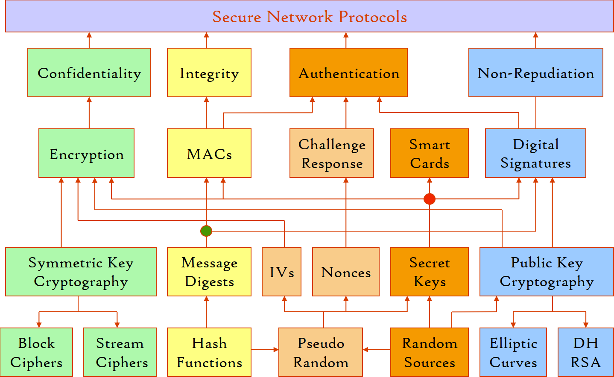

# Cryptology

- [Kerckhoffs's Principle](Kerckhoffs's%20Principle.md)
- [Security Level](Security%20Level.md)
- [Authenticated Encryption](Authenticated%20Encryption.md)

## [Random Number Generation](Random/README.md)
- [True Random Number Generators](Random/True/README.md)
- Pseudorandom Number Generators
  - [Linear Feedback Shift Registers](Random/Pseudo/Linear%20Feedback%20Shift%20Registers.md)
  - Cryptographically Secure Pseudorandom Number Generator

## Symmetric cryptography
### Stream ciphers
#### Ciphers
- XOR
- RC4
- [Salsa20](Symmetric/Stream/Salsa20/README.md)
  - [ChaCha](Symmetric/Stream/Salsa20/ChaCha/README.md)
- Trivium

[eSTREAM portfolio](https://en.wikipedia.org/wiki/ESTREAM#eSTREAM_portfolio):
- Software
  - HC-128
  - Rabbit
  - Salsa20
  - SOSEMANUK
  
- Hardware
  - Grain
  - MICKEY
  - Trivium

### Block ciphers
#### Ciphers
- AES (Rijndael)
- Blowfish
  - Twofish
  - Threefish
- DES
  - Triple DES
  - DES-X
- IDEA
- Rivert Ciphers
  - RC2
  - RC5
  - RC6
- SM4
- TEA
  - TEA
  - XTEA
  - XXTEA

## Asymmetric cryptography
- Integer factorization
  - [RSA (Rivest–Shamir–Adleman)](Asymmetric/RSA/README.md)
    - [PKCS #1](Asymmetric/RSA/PKCS%20%231.md)
- Discrete logarithm
  - DH
- Lattice

## [Hash functions](Hash%20Functions/README.md)
- Universal Hashing

### Checksums
- Cyclic redundancy checks
  - CRC-16
  - CRC-32
  - CRC-64
- Internet checksum

### Non-cryptographic hash functions
- xxHash

### Unkeyed cryptographic hash functions
- [Message-Digest](Hash%20Functions/Message-Digest/README.md)
  - MD2
  - MD4
  - [MD5](Hash%20Functions/Message-Digest/MD5.md)
  - MD6
- Secure Hash Algorithm
  - SHA-0
  - SHA-1
  - SHA-2
    - SHA-224
    - SHA-256
    - SHA-384
    - SHA-512
  - SHA-3 (Keccak)

### [Keyed cryptographic hash functions](Hash%20Functions/Keyed/README.md)
- CBC-MAC
- HMAC
- MD6
- One-key MAC
  - OMAC1 (CMAC)
  - OMAC2

## Cryptanalysis
- [Attack Models](Cryptanalysis/Attack%20Models.md)